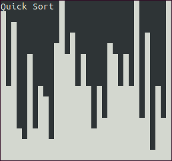

Sorting Visualizer
==================
This is a very simple little project which demonstrates the differences between
a variety of sorting algorithms. The project uses ncurses, which means that it
will run on most Unix systems without the need to download any depenedcies.

## Getting Started
The following will get the project ready to run on your local machine.

### Requirements
In order to run the maze program, you will need the following:
* ncurses (readily available on most Linux Distros)

### Installation and Use
To use the sorting visualizer program, simply clone it from this repo
``` bash
git clone git@github.com:ian-howell/sort-visualizer.git
```

Once you have the project on your machine, you can build it with
``` bash
make
```

This will generate a binary called `driver`. To use it, simply run
``` bash
./driver --algorithm=<sort_type> --speed=<fps>
```
where \<sort_type\> is one of `bubble`, `insert`, `select`, or `quick`, and
\<fps\> is an integer in the range [1...60]

## Table of Contents
**[Bubble Sort](#bubble-sort)**<br>
**[Selection Sort](#selection-sort)**<br>
**[Insertion Sort](#insertion-sort)**<br>
**[Quicksort](#quicksort)**<br>


### Bubble Sort

<p align="center">
  
</p>

### Selection Sort

<p align="center">
  
</p>

### Insertion Sort

<p align="center">
  
</p>

### Quicksort

<p align="center">
  
</p>

